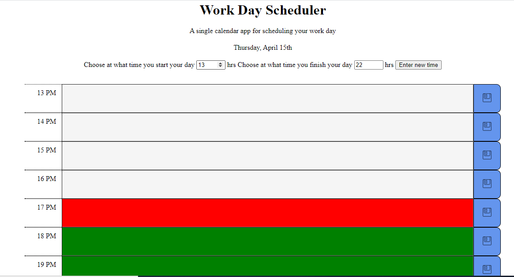

# P5-Work-Day-Scheduler

## App Description
In this little app you will be able to schedule your different daily activities and save them so that in case you refresh the page, the todos will remain displayed. In this app you can choose the time in which you start and you finish your activities and along the day passes, the app will tell you in a color manner whether the time is passed, is current or to come. In case you want to reset the ap.p to the initial configuration and erase the todos, you can do it by pressing the button of reset

## ScreenShot

## Using the Work Day Planner
### Entering your starting and finishing time
The app by default will choose time between 9am and 6pm to set your schedule, but you can set your own by putting the numbers in the inputs, please notice that in case you choose a starting time equal or bigger than your finishing time, an alert will come up on the screen.

### Saving your activities
In order to save your activities, you must type them on the inputs and either click on the save icon or pressing the enter key.

### Reseting to initial values
For you to reset the app to the initial values at which you start and finish your day and also to erase the saved activities, you only have to click on the reset button.

## Link to the app
https://cbrito1994.github.io/P5-Work-Day-Scheduler/